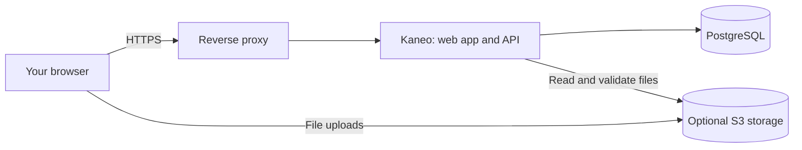

Kaneo runs as one application container plus PostgreSQL. You can add file storage and email when you need them. Redis is only needed when multiple API instances must share live updates.

## Choose your setup

| Setup | Choose this when… |
| --- | --- |
| [Docker Compose](/core/installation/docker-compose) | You want to see and control the configuration. Start here for a local trial or an existing server. |
| [drim](/core/installation/drim) | You want a CLI to generate the deployment and set up Caddy for HTTPS. |
| [Coolify](/core/deployments/coolify) | You already deploy applications through Coolify. |
| [Railway](/core/deployments/railway) | You want a hosted deployment without managing a server. |
| [Helm](https://github.com/usekaneo/kaneo/tree/main/charts/kaneo) | You already operate a Kubernetes cluster. |

For a small installation, plan for at least 2 GB of memory and 10 GB of free disk as a starting point. Leave additional space for database growth, uploaded files, and backups. Compose deployments need Docker and Docker Compose V2.

## What runs where

PostgreSQL stores accounts, projects, tasks, comments, and upload records. File contents live in your configured object storage. Account avatars are stored in PostgreSQL.

## Before inviting your team

1. Put the instance behind [HTTPS](/core/reverse-proxy/nginx).
2. Create the initial administrator account before opening registration to others.
3. Configure [email and access settings](/core/installation/environment-variables).
4. Add [Silo file storage](/core/installation/silo) if your team needs attachments.
5. Make a [backup and test a restore](/core/operations/backups).

Then follow [Your first project](/core/index).
