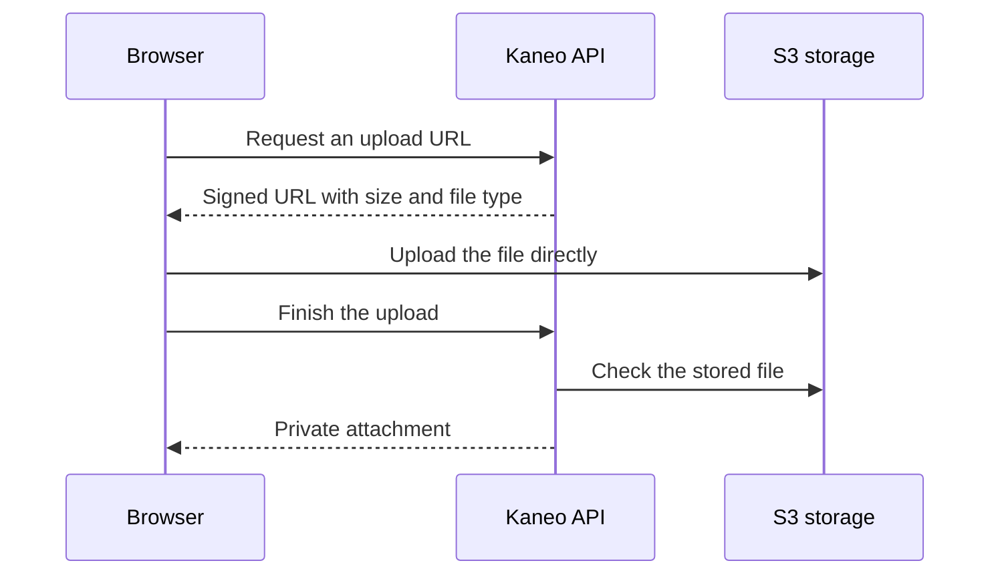

File storage is optional. Kaneo works without it, but people cannot upload files into task descriptions or comments until you configure an S3-compatible backend.

Use [Silo](/core/installation/silo) to host storage yourself. If you already use a managed service, follow [AWS S3 or Cloudflare R2](/core/installation/storage-backends).

## How an upload works



The browser and the Kaneo API must both reach `S3_ENDPOINT`. Use a hostname such as `https://files.example.com`. An internal Docker name such as `http://silo:9000` will not work in a normal browser, even if the containers can reach one another.

The storage bucket stays private. Kaneo checks access and serves files through its own API. Images appear inline; PDFs, ZIPs, and other files appear as attachments.

## Required configuration

```env
S3_ENDPOINT=https://files.example.com
S3_BUCKET=kaneo-uploads
S3_ACCESS_KEY_ID=your-bucket-access-key
S3_SECRET_ACCESS_KEY=your-bucket-secret-key
S3_REGION=us-east-1
S3_FORCE_PATH_STYLE=true
```

Use a dedicated credential with read, write, and delete access to this bucket. Kaneo uses `GetObject`, including HEAD requests, to check uploads and read files. It also needs `PutObject` and `DeleteObject`.

On AWS you can [use an IAM role](/core/installation/storage-backends#aws-s3) instead of static keys. Set both key variables or leave both unset.

## Limits and browser access

The default upload limit is 10 MiB. Change `S3_MAX_IMAGE_UPLOAD_BYTES` to set another limit in bytes; despite its name, it also covers non-image attachments. Signed upload URLs expire after 300 seconds by default, controlled by `S3_PRESIGN_TTL_SECONDS`.

Configure storage CORS to allow your exact Kaneo origin and `PUT` requests with `Content-Type`. Both the storage endpoint and Kaneo should use HTTPS for a public deployment.

Custom upload clients must send the exact declared `Content-Length` and the returned `Content-Type`. Kaneo checks the stored object before finalizing it. Do not remove signed-header checks to work around an incompatible provider.

## Check it works

1. Open a task and attach a small image to its description.
2. Confirm the image appears, then reload the page.
3. Add a PDF or text file to a comment and open the attachment.
4. Check that a person without access cannot retrieve the private file.

Repeat this check after storage or proxy upgrades. If it fails, use [upload troubleshooting](/core/operations/troubleshooting#uploads-fail).

Back up the [database and the files together](/core/operations/backups). A database backup contains attachment records, not their file contents.
